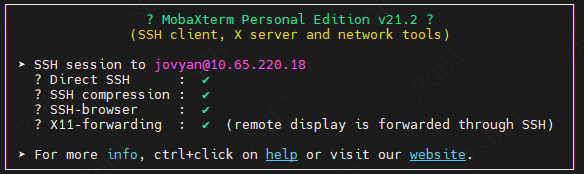
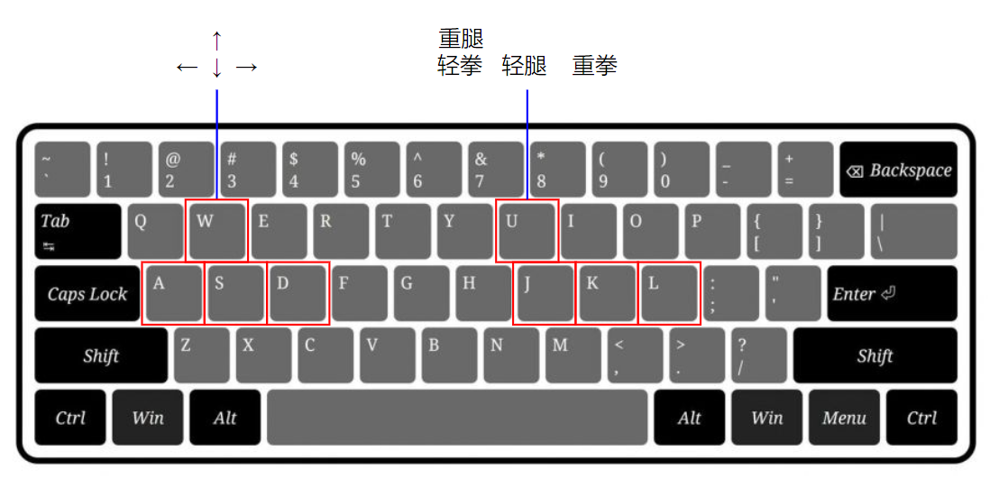

## 拳皇97强化学习小游戏

### 特性

+ **AI-AI训练** 传统与内置基于规则的机器人训练方式，容易过拟合到特定的环境，在实际人机交互中表现较差。因此本项目设计了AI-AI的训练方式，两个AI交替训练提升AI在实际对战中的鲁棒性。
+ **Human-AI交互** 本项目集成了人机交互功能，可以在linux服务器运行强化学习模型与游戏，通过X11转发到本地电脑与云端AI进行对战。

### 安装
#### GPU服务器端
```
conda env create -f env/game_AI.yaml
pip install -r env/packages.txt
```
#### 本地电脑
1. 安装MobaXterm
2. Settings->Configration->X11-> X11 Remote Access选择为full
3. 连接远程服务器，正常显示为


4. 输入$DISPLAY可以看到输出```localhost:xx.0```
5. 保持MobaXterm连接，可以在VSCode中进行开发
**需要在VSCode终端中重新赋值DISPLAY环境变量与MobaXterm终端保持一致**


### Human-AI交互
启动后，有错误请忽略，等待半分钟左右会有游戏窗口弹出。如果没有，请查看下任务栏。
```
sh scripts/run.sh
```
+ 开始游戏：Ctrl+P
+ 游戏操作：


### AI-AI训练
```
sh scripts/train.sh
```

### 工程结构与注释

```
.
├── env # python环境安装文件
│   ├── game_AI.yaml # conda环境
│   └── packages.txt # pip环境
├── king_of_fighter
│   ├── actions.py # 动作ID与ROM所识别指令的转换
│   ├── address.py # 拳皇97环境状态变量查询地址
│   ├── baseline.py # AI-AI训练主程序
│   ├── comble.py # 人物招式的基础动作组合
│   ├── debug.py # Human-AI交互主程序
│   ├── keyboard_play.py # Human-AI交互相关库
│   ├── king_of_fight_custom_wrapper.py # 与训练相关函数的封装，如每步reward计算、招式缓存、招式镜像等
│   ├── kof_environment.py # 与ROM交互的底层函数封装，如获取图像、输入动作、获取环境状态等
│   ├── monitor.py # 监测训练过程的变量，如，奖励、损失、胜率等，但此项目中相关功能集成在了wrapper中
│   ├── ppo # 强化学习训练库
│   │   ├── base_class.py
│   │   ├── cnn_policy.py # 卷积网络Actor-Critic，输入观测（图像），输出动作（action）
│   │   ├── dummy_vec_env.py
│   │   ├── on_policy_algorithm.py # 环境交互、多步环境状态保存、奖励设计、训练策略
│   │   ├── ppo.py # 损失计算与优化
│   │   ├── resnet_customer.py # 残差卷积网络实现
│   │   ├── resnet_policy.py # 残差卷积网络Actor-Critic，输入观测（图像），输出动作（action）与状态评分（value）
│   │   └── torch_layers.py
│   ├── steps.py # 从游戏初始状态自动选人的步骤（可以直接将游戏状态存下来加载，见status目录）
│   └── visualize.py # 两AI对战可视化
├── README.md
├── roms
│   ├── kof97 # 拳皇97 ROM文件
│   │   ├── 000-lo.lo
│   │   ├── 232-c1.bin
│   │   ├── ...
│   └── sfiii3 # 街霸3 ROM文件
│       ├── sfiii3_japan_nocd.29f400.u2
│       ├── sfiii3-simm1.0
│       ├── ...
├── status # 游戏状态检查点可以直接加载，避免每局游戏后重新加载整个游戏，浪费时间
│   ├── iori_2p_started # 两个八神AI对战，对战起始状态
│   ├── kyo_2p_started # 两个草薙京AI对战，对战起始状态
│   ├── kyo_2p_started_play # 两个草薙京AI对战，对战倒数状态
│   ├── mai_2p_started # 两个火舞AI对战，对战起始状态
│   ├── wait_for_fight_start_stage_01 # AI与难度1电脑对战，对战起始状态
│   └── wait_for_fight_start_stage_02 # AI与难度2电脑对战，对战起始状态
├── trained_models # 模型检查点
│   ├── ppo_kyo_resnet_2p_100000_steps.zip
│   ├── ...
└── scripts
    ├── train.sh # 训练脚本
    └── run.sh # Human-AI交互脚本
```

### 二次开发

+ 训练策略与奖励调整：king_of_fighter/ppo/on_policy_algorithm.py（目前是双AI交互训练）
+ 修改基础招式：king_of_fighter/comble.py（目前是集成了一些容易发出的招式）
+ Actor-Critic网络：king_of_fighter/resnet_policy.py（目前是resnet）
+ 修改观测：king_of_fighter/kof_environment.py（目前是三帧图像分别取RGB通道拼在一起）